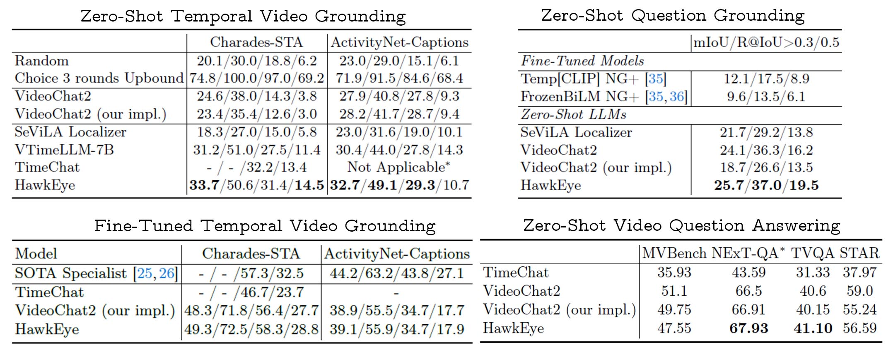
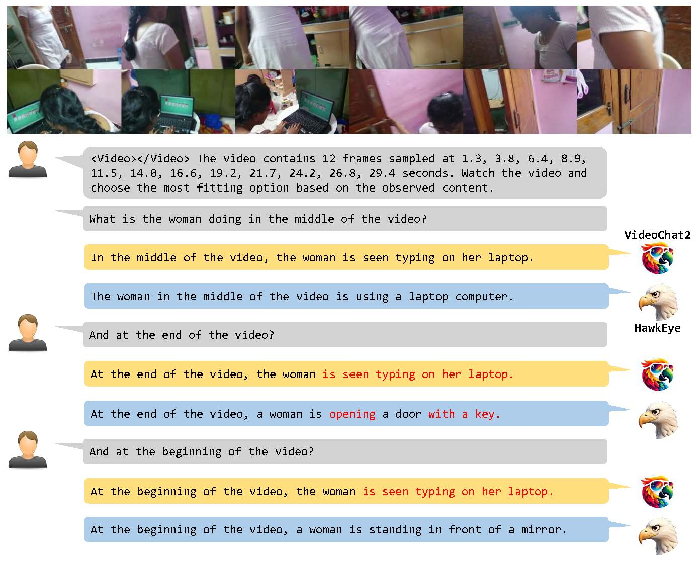
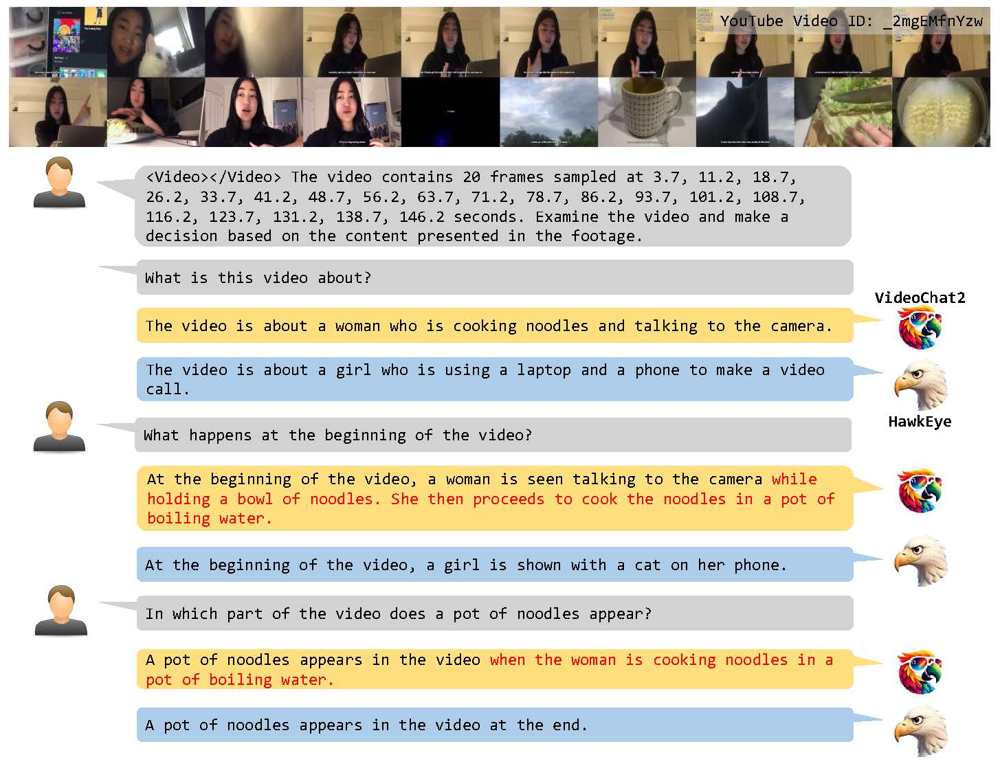

# <div style="display: flex; align-items: center;">  <span style="margin: 0 10;">&emsp;HawkEye: Training Video-Text LLMs for Grounding Text in Videos</span> </div>

[**[Paper]**](https://arxiv.org/abs/2403.10228)
[**[Checkpoint]**](https://huggingface.co/wangyueqian/HawkEye)
[**[Dataset]**](internvid_g/README.md)


## Introduction

Video-text Large Language Models (video-text LLMs) have shown remarkable performance in answering questions and holding conversations on simple videos. 
However, they perform almost the same as random on grounding text queries in long and complicated videos, having little ability to understand and reason about temporal information, which is the most fundamental difference between videos and images. 

We propose HawkEye, one of the first video-text LLMs that can perform temporal video grounding in a fully text-to-text manner. To collect training data that is applicable for temporal video grounding, we construct InternVid-G, a large-scale video-text corpus with segment-level captions and negative spans, with which we introduce two new time-aware training objectives to video-text LLMs. We also propose a coarse-grained method of representing segments in videos, which is more robust and easier for LLMs to learn and follow than other alternatives. 

### Datasets and Models
We release our HawkEye and our impl. VideoChat2 [**Model Checkpoints**](https://huggingface.co/wangyueqian/HawkEye), and [**InternVid-G Dataset**](internvid_g/README.md) at 🤗HuggingFace.

## Demo



**Live Demo In progress**

You can use `demo.ipynb` to test HawkEye on your data.

## Training
### Download model checkpoints
- Follow [here](https://github.com/OpenGVLab/Ask-Anything/tree/main/video_chat#running-usage) to prepare vicuna-7b-v0
- Download [umt_l16_qformer.pth](https://pjlab-gvm-data.oss-cn-shanghai.aliyuncs.com/videochat2/umt_l16_qformer.pth) and [videochat2_7b_stage2.pth](https://pjlab-gvm-data.oss-cn-shanghai.aliyuncs.com/videochat2/videochat2_7b_stage2.pth) from [VideoChat2](https://github.com/OpenGVLab/Ask-Anything/tree/main/video_chat2)

After downloading all model checkpoints, the `model/` folder should looks like this:
```
└── VideoChat2/
    └── umt_l16_qformer.pth
    └── videochat2_7b_stage2.pth
└── vicuna-7b/
```

### Data preparation

Download from [Dataset Homepage at 🤗HuggingFace](https://huggingface.co/datasets/wangyueqian/HawkEye-IT), and save in `data/HawkEye-IT/` folder. We also provide data proessing code in `data_preparing/`, you can use it for reference.

Note that you also need to download the videos of each dataset from their original links, which is further explained in dataset homepage (this may take quite a while 🙃). Use soft links to link the video folder under `data/videos/`.

After data preparation, the `data/` folder should looks like this:
```
└── HawkEye-IT/
    └── image/  # inherited from VideoChat2-IT, but not used in training HawkEye
    └── video/
        └── temporal/
            └── internvid_grounding/, charades_sta_grounding/, anetc_grounding/
                └── instructions.json, questions.json, train.json
            └── internvid_caption/
                └── instructions.json, train.json
        └── caption/, classification/, conversation/, vqa/, reasoning/
└── videos/
    └── internvid-g/, clevrer/, webvid/, activitynet/, tgif/,
    └── nextqa/, textvr/, youcook2/, kinetics/, ssv2/, charades/
```
Note that `image/, caption/, classification/, conversation/, vqa/, reasoning/` folders of HawkEye-IT are identical to [VideoChat2-IT](https://huggingface.co/datasets/OpenGVLab/VideoChat2-IT).

### Run the instruction tuning process
```shell
bash ./scripts/train/run_7b_stage3.sh OUTPUT_PATH
```
The instruction-tuned HawkEye checkpoint will be saved in `OUTPUT_PATH/ckpt_${ckpt}.pth`, where `${ckpt}` is the number of iterations you train.

Check the script to ensure the hyperparameters fit your computing device.

### Run the finetuning process
We also provide the scripts to finetune on Charades-STA and ActivityNet-Captions:
```shell
# IT_CKPT: the instruction-tuned HawkEye checkpoint
bash ./scripts/train/charades_sta.sh OUTPUT_PATH IT_CKPT
bash ./scripts/train/anetc.sh OUTPUT_PATH IT_CKPT
```
Check the script to ensure the hyperparameters fit your computing device.

## Testing
### Data preparation
1. Download [MVBench](https://huggingface.co/datasets/OpenGVLab/MVBench) and save in `data/MVBench/` folder.

2. Download the annotation of other benchmarks from [Google Drive](https://drive.google.com/file/d/1WVx_UGAnCmBIp8GgCpvtxHHenpYVur5u/view?usp=sharing) and unzip to `data/test-anno/`. We also provide data proessing code in `data_preparing/`, you can use it for reference.

3. Download [TVQA videos](https://tvqa.cs.unc.edu/) and link it at `data/videos/tvqa`

After downloading all benchmarks, the `data/` folder should like this:
```
└── HawkEye-IT/      # instruct tuning datasets
└── MVBench/
└── test-anno/
    └── charades_sta-recursive_grounding.json, anetc-recursive_grounding.json
    └── nextgqa-recursive_grounding.json
    └── nextqa-test.json, tvqa-test.json, star-test.json
└── videos/
    └── nextqa/, tvqa/, charades/, activitynet/, ...
```

#### Test on video qa benchmarks
```
bash ./scripts/test/videoqa.sh
```
refer to `data_preparing/videoqa.py` to convert the model outputs to the format required by [STAR evaluation](https://eval.ai/web/challenges/challenge-page/1325/overview) and [TVQA evaluation w/ ts](https://codalab.lisn.upsaclay.fr/competitions/6978).

#### Test on temporal video grounding benchmarks with recursive grounding
```
bash ./scripts/test/recursive_grounding.sh
```
To analyze the results of each recursive grounding step, refer to `data_preparing/check_grounding_results.ipynb`.

## Citation
If you find this code useful in your research, please consider citing:
```bibtex
@misc{wang2024hawkeye,
      title={HawkEye: Training Video-Text LLMs for Grounding Text in Videos}, 
      author={Yueqian Wang and Xiaojun Meng and Jianxin Liang and Yuxuan Wang and Qun Liu and Dongyan Zhao},
      year={2024},
      eprint={2403.10228},
      archivePrefix={arXiv},
      primaryClass={cs.CV}
}
```

## Acknowledgments
This project is based on [VideoChat and VideoChat2](https://github.com/OpenGVLab/Ask-Anything). Thanks for their great work!
