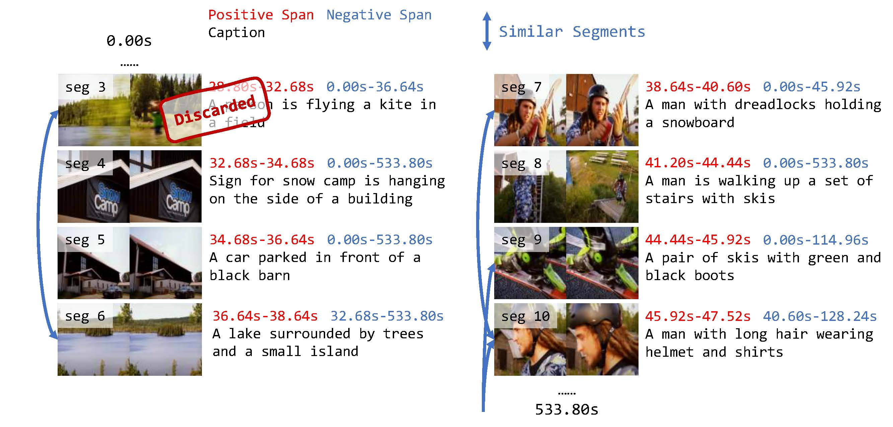

InternVid-G: A Large-Scale Video-Text Dataset with Scene-Level Annotations for Temporal Grounding
===


InternVid-G is a dataset based on a fraction of videos from [InternVid](https://github.com/OpenGVLab/InternVideo/tree/main/Data/InternVid). It has segment-level annotation, where each segment is annotated with:
- a caption, which is related to the semantic content of this segment;
- `start_sec` and `end_sec` of this segment;
- a `neg_start_sec` and a `neg_end_sec` that defines a "negative span" of this segment. All other segments in the negative span are not semantically similar to the this segment (and its caption), so it can serve as the context for temporal video grounding models to retrieve this segment from.

# Data Download
You can download the annotations from [🤗HuggingFace](https://huggingface.co/datasets/wangyueqian/InternVid-G)

You can use `code/download_videos.py` to download the videos from YouTube.

# Processing (Optional)
We also provide code for reproducing (downloading and processing) InternVid-G in `code/`. We hope this code will help you work with your datasets.

This code is only for your reference, and we strongly suggest you read the code and become familiar with it before using it.

1. Save a list of YouTube video ids of your interest in `temp/video_ids.txt`. Save them one id per line, which looks like this:
```text
UkQzZimp7Qs
vJxjY1-0120
11mh9C7RCqg
dcIuh7JaxWw
d5i7JiBAMtc
J0aVIs-eLMA
...
```

2. Download the videos
```shell
python code/download_videos.py --src_file temp/video_ids.txt --target_dir videos --num_workers 5
```

3. Split the videos into scenes using [PySceneDetect](https://github.com/Breakthrough/PySceneDetect)
```shell
python code/clip_sim.py --func split_scene --scene-fname temp/scenes.jsonl
```
The splitted scenes are saved at `temp/scenes.jsonl`. This process may take a long time as PySceneDetect processes the video frame-by-frame.

4. Calculate the similarities of all scenes with each other, and get a scene sim matrix
```shell
python code/clip_sim.py --func scene_sim --scene-fname temp/scenes.jsonl --scene-sim-fname temp/scenes_similarity.jsonl
```
The similarity matrices of the segments is saved at `temp/scenes_similarity.jsonl`.

5. Merge the most similar consecutive scenes, and the merged scene sim matrix
```shell
python code/clip_sim.py --func merge_scene \
--scene-fname temp/scenes.jsonl --scene-sim-fname temp/scenes_similarity.jsonl \
--scene-merged-fname temp/scenes-merged.jsonl --scene-merged-sim-fname temp/scenes_merged_similarity.jsonl
```
The merged scenes and similarity matrices are saved at `temp/scenes-merged.jsonl` and `temp/scenes_merged_similarity.jsonl`.

6. Use a captioning model to get the caption of each scene (we find BLIP-2 works best in our case)
```shell
python code/caption_clips.py --func blip2 \
--scene-fname temp/scenes-merged.jsonl --blip2-fname temp/scenes-blip2.jsonl
```
The segment captions are saved at `temp/scenes-blip2.jsonl`.

7. Calculate the similarity between each segment and its caption, remove the ones with low similarity
```shell
python code/caption_clips.py --func filter --merge-method max \
--filter-input-fname temp/scenes-blip2.jsonl \
--filtered-fname temp/scenes-blip2-filtered.jsonl \

python code/caption_clips.py --func merge_filtered_captions 
--filter-input-fname temp/scenes-blip2-filtered.jsonl \
--filtered-fname temp/scenes-blip2-filtered-high_sims.jsonl \
```
All segment-caption pairs with high similarities that are not filterd are saved in `temp/scenes-blip2-filtered-high_sims.jsonl`.

8. (Finally the last step!) Get a negative span for each segment.
```shell
python code/ground_data_construction.py \
--caption-fname temp/scenes-blip2-filtered-high_sims.jsonl \
--scene-fname temp/scenes-merged.jsonl --scene-sim-fname temp/scenes_similarity-merged.jsonl \
--caption-with-neg-interval-fname temp/final_dataset.jsonl
```
Finally you can get all annotations in `temp/final_dataset.jsonl`.

# Citation
If you find this code useful in your research, please consider citing:
```bibtex
@misc{wang2024hawkeye,
      title={HawkEye: Training Video-Text LLMs for Grounding Text in Videos}, 
      author={Yueqian Wang and Xiaojun Meng and Jianxin Liang and Yuxuan Wang and Qun Liu and Dongyan Zhao},
      year={2024},
      eprint={2403.10228},
      archivePrefix={arXiv},
      primaryClass={cs.CV}
}
```